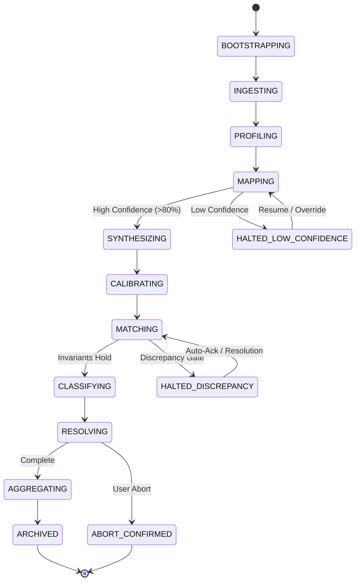
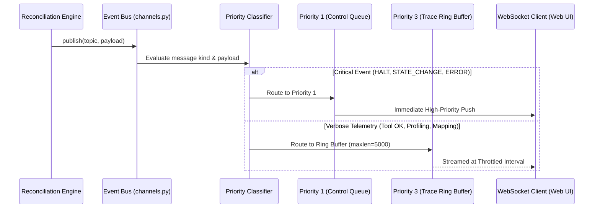

# System Architecture & Technical Blueprint

**Project**: Razorpay Autonomous Financial Reconciliation Agent  
**Revision**: Production Release 1.0  
**Domain**: Enterprise Autonomous Financial Reconciliation & Settlement Chaining  

---

## 1. Architectural Philosophy: Domain-Driven Layering

The system adopts a strict **Domain-Driven Design (DDD)** layered architecture, separating low-level infrastructure, core domain accounting algorithms, and transport protocols.

```mermaid
graph TD
    Client[Web UI / CLI Client]
    
    subgraph Server Layer [Transport & Delivery: src/app/server/]
        FastAPI[FastAPI Web Server: main.py]
        APIv2[REST API v2: api_v2.py]
        WS[Priority WebSocket Stream: ws_v2]
    end
    
    subgraph Engine Layer [Domain Business Logic: src/app/engine/]
        Pipeline[Orchestrator: pipeline.py]
        Matching[Multi-Attribute Matching: matching.py]
        FeeEngine[Fee & Tax Calculator: fee.py]
        Rules[Dynamic Rule Compiler: rule_compiler.py]
        MultiWay[3-Legged Settlement Chaining: multiway.py]
        Resolving[Exception Classifier: resolving.py]
        ChatEngine[Grounded Assistant: chatbot.py]
    end
    
    subgraph Core Layer [Infrastructure & Contracts: src/app/core/]
        FSM[14-State Machine: state_machine.py]
        Audit[Cryptographic SHA-256 Ledger: audit.py]
        EventBus[Priority Event Bus: channels.py]
        Contracts[Pydantic Domain Models: contracts.py]
        Masking[PII Redaction Engine: masking.py]
        LLM[Gemma / Gemini Gateway: llm_client.py]
    end

    Client -->|HTTP / WebSocket| Server Layer
    Server Layer -->|Invokes Commands| Engine Layer
    Engine Layer -->|Emits Events & State Transitions| Core Layer
    Engine Layer -->|Signs Records| Audit
    EventBus -->|Pushes Real-Time Telemetry| WS
```

### Layer Separation Matrix

| Layer | Directory | Responsibilities | Key Dependencies |
| :--- | :--- | :--- | :--- |
| **Transport** | `src/app/server/` | HTTP request dispatching, WebSocket lifecycle, file streaming, CORS, and UI mounting. | `fastapi`, `uvicorn`, `starlette` |
| **Engine** | `src/app/engine/` | Matching heuristics, fee schedules, dynamic segment rule compilation, split solving, and report synthesis. | `pandas`, `numpy`, `pydantic` |
| **Core** | `src/app/core/` | State machine validation, cryptographic SHA-256 hashing, PII masking, LLM client, and domain contracts. | Pure standard library + `pydantic`, `hashlib` |

---

## 2. Finite State Machine (14-State Lifecycle)

Every reconciliation run executes under the strict governance of an acyclic **14-State Finite State Machine (`PipelineStateMachine`)** defined in `src/app/core/state_machine.py`. State transitions are atomic, validated against a directed transition graph, and committed to the cryptographic audit trail.



### State Transition Invariants
1. **Low-Confidence Halt**: If semantic column mapping confidence falls below 80%, the engine enters `HALTED_LOW_CONFIDENCE`, demanding human verification or fallback heuristics before proceeding.
2. **Deterministic Re-entry**: Resuming a halted pipeline never bypasses previous state validations.
3. **Terminal Immutability**: Once in `ARCHIVED` or `ABORT_CONFIRMED`, state changes are forbidden. Any subsequent queries or runs generate an isolated, fresh pipeline session.

---

## 3. Priority Event Bus & Real-Time Telemetry

The internal event dispatcher (`src/app/core/channels.py`) implements an asynchronous priority queue ensuring critical control messages take precedence over verbose debug traces.



---

## 4. Multi-Way Three-Legged Chaining Architecture

For complex enterprise payment ecosystems, the engine supports **Three-Legged Chaining** connecting merchant order systems, payment gateway intermediary ledgers, and bank statement settlement deposits.

```mermaid
flowchart LR
    subgraph Leg1 [Leg 1: Order Checkout]
        A[Merchant Sales Ledger\n'payments.csv'] -->|Gross Order Amount| B[Payment Gateway Ledger\n'gateway_settlements.csv']
    end
    
    subgraph Leg2 [Leg 2: Gateway Settlement]
        B -->|Net Settlement Deposit\n(Gross - MDR - GST)| C[Bank Operating Statement\n'bank.csv']
    end
    
    subgraph Consolidated [Transitive Multi-Way Settlement State]
        A -.->|Full Transitive Trace| C
        D[Cash Position & Aging Monitor]
        E[Double-Entry Journal Synthesizer]
    end
    
    Leg1 --> Consolidated
    Leg2 --> Consolidated
```

### Financial Conservation Check
The multi-way chaining controller enforces the conservation invariant across all legs:

$$\text{Projected Closing} = \text{Opening Balance} + \text{Gross Orders} - \text{Gateway MDR} - \text{GST} - \text{Refund Reserves} - \text{Bank Settlements}$$

Any variance exceeding $\pm \text{INR } 0.05$ halts the pipeline and raises an exception.
