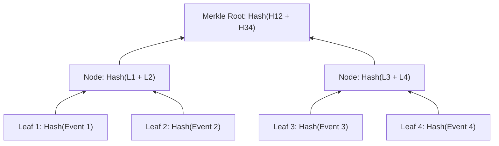
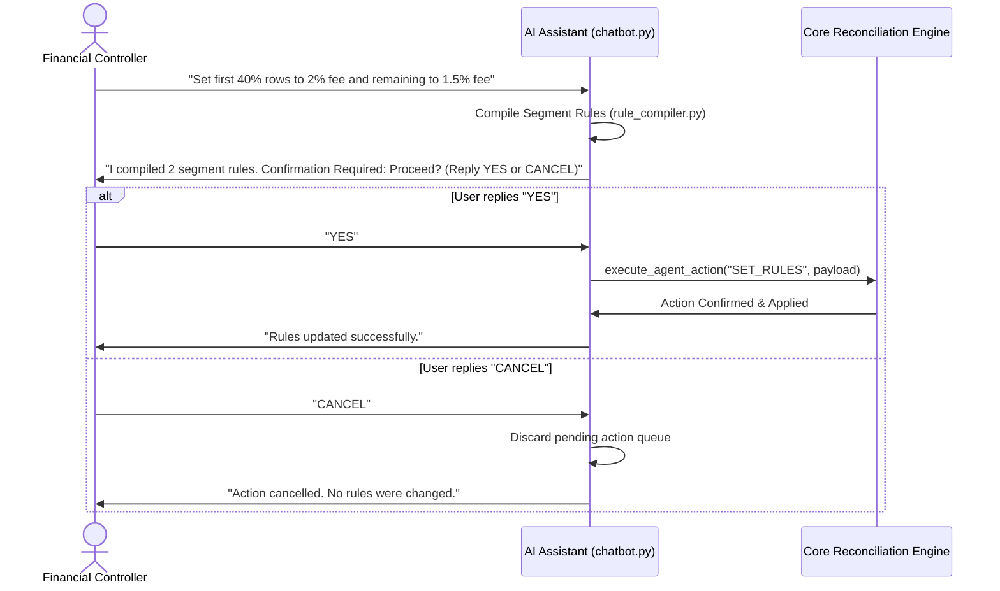

# Security, Cryptographic Audit & Compliance Architecture

**Project**: Razorpay Autonomous Financial Reconciliation Agent
**Scope**: Tamper-Evident Hashing, PII Masking, Confirmation Gates, and Audit Verification  

---

## 1. Cryptographic SHA-256 Tamper-Evident Audit Trail

Financial reconciliation requires absolute auditability. The engine maintains an append-only, cryptographically chained audit log (`*.audit.jsonl`) generated by `src/app/core/audit.py`. Every state transition, mapping decision, fee calculation, exception classification, and user override is signed into this ledger.

### Chained Block Schema

Each audit record contains a forward hash link binding it irrevocably to its predecessor:

```json
{
  "event_id": "evt_7f8c12a0",
  "ts": "2026-09-05T01:40:00.123456Z",
  "session_id": "e2785d2d",
  "state": "MATCHING",
  "event_type": "PAIR_MATCHED",
  "parent_hash": "8f1a23c098df...",
  "payload": {
    "l_rid": 104,
    "r_rid": 98,
    "score": 0.998,
    "gross_amount": 4500.0,
    "net_amount": 4393.8
  },
  "entry_hash": "b4e29781cf01..."
}
```

$$\text{entry\_hash}_i = \text{SHA256}(\text{event\_id} \mathbin{\Vert} \text{ts} \mathbin{\Vert} \text{session\_id} \mathbin{\Vert} \text{parent\_hash} \mathbin{\Vert} \text{JSON}(\text{payload}))$$

### Merkle Root Verification
Upon pipeline completion, the engine computes a balanced Merkle tree over all entry hashes:



The resulting `merkle_root` is embedded in the final report. An independent auditor can verify the entire session's integrity using the built-in verifier:

```python
from app.core.audit import verify_audit_chain

is_valid, error_msg = verify_audit_chain("data/audit/e2785d2d.audit.jsonl")
assert is_valid, f"Audit chain tampered: {error_msg}"
```

If an adversary alters even one character or transaction delta in the log file, the hash chain breaks immediately, producing a validation failure.

---

## 2. PII Redaction & Data Privacy Engine

To comply with PCI-DSS and global data privacy regulations, customer Personally Identifiable Information (PII) is masked by `src/app/core/masking.py` before any data is sent to external LLMs or broadcast over WebSocket telemetry.

### Redaction Rules Matrix

| Field Type | Source Pattern | Masked Representation | Strategy |
| :--- | :--- | :--- | :--- |
| **Permanent Account Number (PAN)** | `[A-Z]{5}[0-9]{4}[A-Z]{1}` | `XXXXX1234A` | Retain issuer series and check digit |
| **Email Addresses** | `[a-zA-Z0-9_.+-]+@[a-zA-Z0-9-]+\.[a-zA-Z0-9-.]+` | `j***e@domain.com` | Obfuscate username, preserve domain |
| **Indian Mobile Numbers** | `(?:(?:\+91\|91)[\s-]?)?[6-9]\d{9}` | `+91-XXXXX-12345` | Obfuscate leading digits, retain tail |
| **Bank Account Numbers** | `\b\d{9,18}\b` (when flagged as account) | `XXXXXXXXXXXX1234` | Retain last 4 digits only |

### Masking Invariants
- **Pre-LLM Sanitization**: All table sample previews injected into `chatbot.py` prompts pass through `mask_pii_string()`.
- **Pre-WebSocket Sanitization**: Log payloads emitted to client browsers are scrubbed of unmasked cardholder data.

---

## 3. Human-in-the-Loop Confirmation Gates

The AI assistant operates under strict confirmation gates for state-mutating actions:



### Safety Constraints:
- State-mutating actions (`RUN_RECONCILIATION`, `SET_POLICY`, `SET_RULES`, `SET_TOLERANCE`) cannot execute autonomously without explicit tokenized confirmation.
- Destructive operations are logged with the initiating reviewer's identity and timestamp in the cryptographic audit chain.
